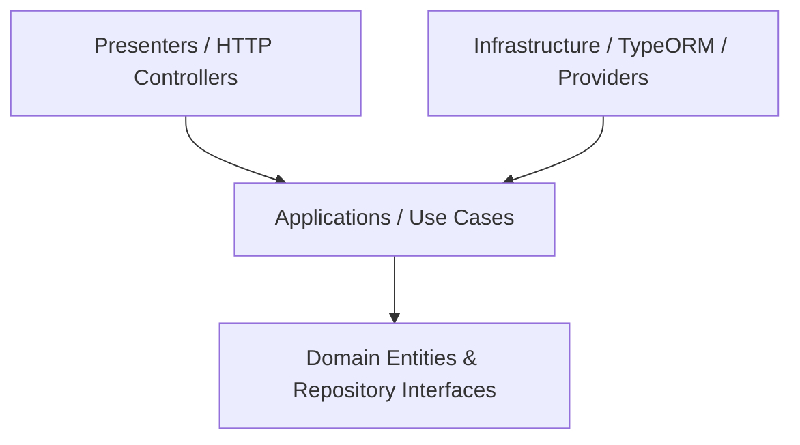

# SOLID Clean Architecture Migration Plan

This document outlines the architectural plan and migration path to transition the `BE` project from a traditional NestJS layered structure to a **SOLID Clean Architecture** (Domain-Driven Design).

## 1. Architectural Principles

To satisfy the SOLID principles:
- **Single Responsibility Principle (SRP)**: Each class has only one reason to change. Controllers handle HTTP parsing, Use Cases coordinate business actions, Domain Entities encapsulate business rules, and Persistence repositories handle database details.
- **Open/Closed Principle (OCP)**: Modules are open for extension but closed for modification. Behaviors can be extended via adapters/interfaces without modifying core logic.
- **Liskov Substitution Principle (LSP)**: Infrastructure repository implementations can be substituted with different storage adapters (e.g. TypeORM, Prisma, In-Memory) without affecting business logic.
- **Interface Segregation Principle (ISP)**: Clients do not depend on methods they do not use. Domain repositories define precise, minimal interfaces.
- **Dependency Inversion Principle (DIP)**: Core Business Logic (Domain & Application) must not depend on low-level details (Infrastructure, TypeORM, NestJS). Instead, low-level details depend on abstractions (interfaces) defined in the Core.

---

## 2. Directory Structure Mapping

We will transition from the current structure to a new structure under `src/domains/`.

### Current Structure
```
src/
├── v1/
│   ├── entities/               # All database entities colocated
│   │   ├── user.entity.ts
│   │   └── ...
│   ├── user/
│   │   ├── dto/
│   │   ├── user.controller.ts
│   │   └── user.service.ts
│   └── ...
```

### Proposed SOLID Structure
```
src/
├── app.module.ts
├── main.ts
│
├── commons/                     # Shared cross-cutting concerns
│   ├── filters/
│   ├── interceptors/
│   ├── guards/
│   └── decorators/
│
└── domains/
    ├── user/                    # User Domain
    │   ├── errors/              # Domain-specific errors
    │   ├── domain/              # 1. Domain Layer (Pure TS)
    │   │   ├── entities/        # Domain entities containing pure business rules
    │   │   └── repositories/    # Interfaces of Repository (DIP)
    │   │
    │   ├── applications/        # 2. Application Layer (Use Cases)
    │   │   ├── use-cases/       # Use case implementations (SRP)
    │   │   └── dtos/            # Input/Output structures for Use Cases
    │   │
    │   ├── infrastructure/      # 3. Infrastructure Layer (Adapters)
    │   │   ├── persistence/     # TypeORM entity mappings & repository implementations
    │   │   │   ├── typeorm-user.entity.ts
    │   │   │   └── typeorm-user.repository.ts
    │   │   └── providers/       # BCrypt, Mail, SMS, third-party adapters
    │   │
    │   ├── presenters/          # 4. HTTP/Controller Layer
    │   │   └── user.controller.ts
    │   │
    │   └── user.module.ts       # NestJS Module tying everything together
```

---

## 3. Dependency Rules

The dependency direction must strictly flow inwards:


- **Domain Layer**: Must be pure TypeScript. No `@nestjs/common` imports, no `@Entity` or `@Column` TypeORM annotations.
- **Application Layer**: Contains Use Cases (e.g. `GetMeUseCase`). Imports only from Domain Layer and DTOs.
- **Infrastructure Layer**: Implements repository interfaces defined in the Domain. Uses TypeORM entity decorators.
- **Presenters Layer**: Controllers inject Use Cases and delegate incoming HTTP requests to them.

---

## 4. Migration Strategy

Due to the size of the codebase (57+ entities), a big-bang refactoring is high-risk. We will execute the migration domain-by-domain:

1. **Create the target directory**: Set up `src/domains/` and `src/commons/`.
2. **Migrate the User Domain as the Proof of Concept (PoC)**:
   - Define User Domain Entity in `src/domains/user/domain/entities/user.domain-entity.ts` (pure TS).
   - Define UserRepository interface in `src/domains/user/domain/repositories/user.repository.interface.ts`.
   - Create Use Cases in `src/domains/user/applications/use-cases/`.
   - Implement TypeORM mapping in `src/domains/user/infrastructure/persistence/typeorm-user.entity.ts` and `typeorm-user.repository.ts`.
   - Create HTTP Controllers in `src/domains/user/presenters/user.controller.ts`.
   - Bind them using NestJS dependency injection in `src/domains/user/user.module.ts`.
3. **Register and test**: Verify that the application continues to run seamlessly.
4. **Iteratively migrate other domains** (e.g. `auth`, `chat`, `post`, `friend`, `comment`, `story`) following the same pattern.
