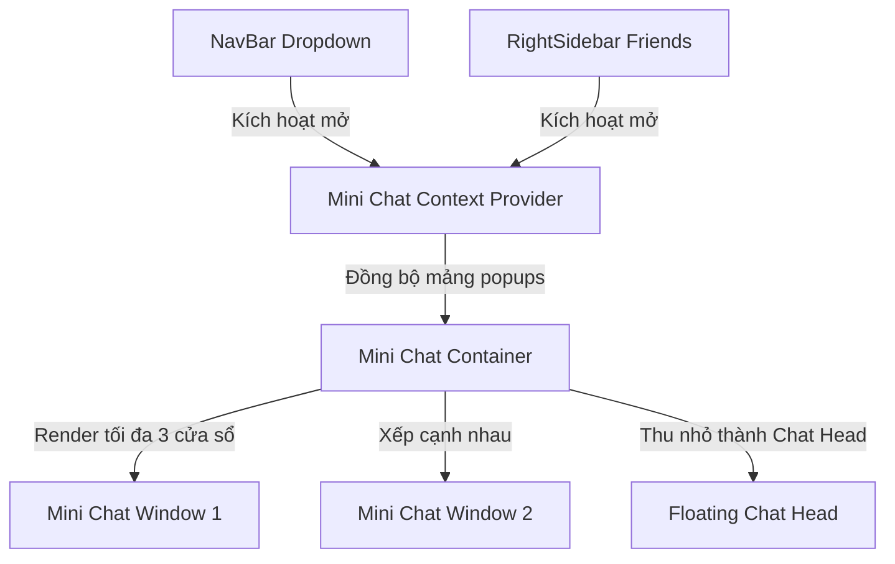

# KẾ HOẠCH TRIỂN KHAI: MINI CHAT POPUP (FACEBOOK-STYLE HEADER CHAT)

Kế hoạch này thiết kế hệ thống nhiều cửa sổ chat thu nhỏ (Mini Chat Popup) xếp chồng ở cạnh dưới màn hình, tích hợp đầy đủ các tính năng realtime (chat, emoji, ảnh/video, trạng thái hoạt động, typing indicator) tương tự Facebook Messenger.

---

## 🗺️ 1. Kiến trúc luồng hoạt động & Quản lý State

Để cho phép bất kỳ component nào trong ứng dụng (Header NavBar, RightSidebar, hoặc trang cá nhân) đều có thể kích hoạt mở cửa sổ chat thu nhỏ, chúng ta sẽ xây dựng một **Mini Chat Context**.

### 🧠 1.1. Quản lý trạng thái Popup (React Context)
*   **`activePopups`**: Danh sách các cuộc hội thoại/bạn bè đang được mở cửa sổ chat nhỏ (Mảng `Contact[]`, giới hạn tối đa **3 cửa sổ** hiển thị cùng lúc để tối ưu giao diện).
*   **`minimizedPopups`**: Danh sách các ID cuộc hội thoại đang được thu nhỏ (chỉ hiện thanh tiêu đề hoặc thu nhỏ thành bong bóng).
*   **`openPopup(contact)`**: Thêm cửa sổ chat cho contact được chọn. Nếu đã mở tối đa 3, cửa sổ cũ nhất sẽ được tự động đóng hoặc thu nhỏ thành Chat Head.
*   **`closePopup(contactId)`**: Đóng cửa sổ và giải phóng kết nối socket của cửa sổ đó.
*   **`toggleMinimize(contactId)`**: Đổi trạng thái thu nhỏ/hiển thị của cửa sổ.

---

## 🎨 2. Thiết kế UI/UX (Premium Style)

### 2.1. Cửa sổ Mini Chat Window
*   **Kích thước**: Rộng `320px`, Cao `400px` (khi hiển thị đầy đủ).
*   **Vị trí**: Xếp ngang góc phải bên dưới màn hình, cách nhau `16px`.
*   **Aesthetics**: Glassmorphism hiện đại (`backdrop-blur-md bg-white/95 border border-slate-100 shadow-[0_12px_40px_rgba(0,0,0,0.12)] rounded-t-2xl overflow-hidden animate-in slide-in-from-bottom duration-300`).
*   **Header**:
    *   Avatar tròn nhỏ kèm chấm xanh/vàng (Online/Idle) thời gian thực.
    *   Tên hiển thị & trạng thái hoạt động ngắn (ví dụ: *"Đang hoạt động"*, *"Tạm vắng"*).
    *   Nút Minimize (Thu nhỏ) và Close (Đóng).
*   **Body**:
    *   Danh sách tin nhắn thu nhỏ (giới hạn chiều cao, hỗ trợ cuộn chuột mượt mà).
    *   Bong bóng chỉ báo soạn thảo tin nhắn nhấp nháy.
*   **Footer**:
    *   Thanh nhập liệu thông minh tích hợp nút gửi nhanh Emoji, chọn ảnh/video.

---

## 📋 3. Lộ trình Triển khai Chi tiết (Atomic Tasks)

### 🟢 Giai đoạn 1: Xây dựng Core Context & Container Layout
- [ ] **Task 1.1**: Khởi tạo `MiniChatContext.tsx` quản lý danh sách cửa sổ đang mở (`activePopups`), trạng thái thu nhỏ (`minimizedPopups`).
- [ ] **Task 1.2**: Bao bọc Layout chính của ứng dụng bằng `MiniChatProvider`.
- [ ] **Task 1.3**: Tạo component `MiniChatContainer.tsx` định vị tuyệt đối ở góc dưới bên phải màn hình (`fixed bottom-0 right-4 z-50 flex items-end gap-4 pointer-events-none`).

### 🔵 Giai đoạn 2: Phát triển Component Cửa sổ Chat nhỏ (`MiniChatWindow.tsx`)
- [ ] **Task 2.1**: Thiết kế Header Bar mượt mà của popup, hỗ trợ click đúp (double-click) để thu nhỏ nhanh (Facebook behavior).
- [ ] **Task 2.2**: Triển khai Body hiển thị tin nhắn mini, tái sử dụng các components bong bóng tin nhắn từ `ChatBox.tsx` nhưng được scale nhỏ size chữ (`text-xs`).
- [ ] **Task 2.3**: Thiết lập Socket listeners độc lập cho từng popup:
    *   Gửi `joinConversation` khi popup mở.
    *   Lắng nghe `newMessage`, `messageSent` tương ứng.
    *   Lắng nghe typing events (`user_typing_start` / `user_typing_stop`).
- [ ] **Task 2.4**: Tích hợp các bộ bổ trợ:
    *   Gửi tin nhắn, gửi Emoji nhanh.
    *   Upload ảnh/video mini (tải lên bất đồng bộ, thanh tiến trình siêu nhỏ).

### 🟠 Giai đoạn 3: Liên kết Sự kiện từ NavBar & RightSidebar
- [ ] **Task 3.1**: Cập nhật danh sách tin nhắn trong dropdown `NavBar.tsx` (MessageCircle): Khi bấm vào một hội thoại bất kỳ, thay vì chuyển trang hoặc mở ChatBox to, kích hoạt `openPopup(contact)`.
- [ ] **Task 3.2**: Cập nhật Contacts trong `RightSidebar.tsx`: Khi click vào bạn bè, tự động mở cửa sổ chat thu nhỏ dưới màn hình.
- [ ] **Task 3.3**: Đồng bộ hóa: Nếu đang mở ChatBox lớn chính giữa màn hình với user A, mở mini chat popup với user A sẽ tự động đóng ChatBox lớn hoặc đồng bộ hóa trạng thái đã xem (seen receipt).

---

## 🛡️ 4. Chỉ số Đánh giá Chất lượng (Quality & Performance Gates)

1.  **Hiệu năng Render**: Khi nhiều cửa sổ chat mở cùng lúc, đảm bảo các hiệu ứng gõ phím không gây tụt khung hình (FPS > 60).
2.  **Quản lý Kết nối Socket**: Tránh rò rỉ socket connection. Khi đóng popup chat, PHẢI tự động emit sự kiện socket `leaveConversation` và xóa toàn bộ socket listeners tương ứng để giải phóng bộ nhớ.
3.  **Responsive Layout**: Trên thiết bị di động (Mobile screens), các popup chat thu nhỏ sẽ tự động ẩn đi và chuyển hướng sang trang chat toàn màn hình thông thường để bảo đảm trải nghiệm người dùng tối đa.
