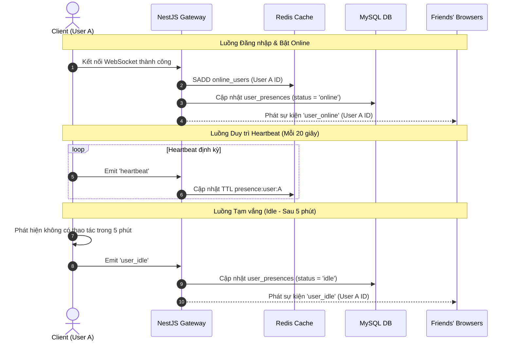

# Kế Hoạch Triển Khai Hệ Thống Trạng Thái Hoạt Động Real-Time (Presence System)

> [!NOTE]
> Kế hoạch này được xây dựng dựa trên bản thiết kế Presence System chuẩn Facebook, hỗ trợ theo dõi trạng thái Online/Offline, Idle (Tạm vắng), Invisible (Ẩn hoạt động), Last Seen (Hoạt động cuối) và Typing Indicator thời gian thực thông qua công nghệ WebSockets (NestJS Gateway & Next.js client) kết hợp với Redis caching để tối ưu hiệu năng chịu tải lớn.

---

## 🏗️ 1. PHÂN RÃ HẠNG MỤC CẦN TRIỂN KHAI (TASK BREAKDOWN)

### 🛠️ Giai đoạn 1: Thiết kế Cơ sở dữ liệu & Cấu hình Redis (Backend)
1. **Thiết lập bảng trong cơ sở dữ liệu MySQL**:
   - Tạo bảng `user_presences` để duy trì trạng thái chính thức và thời gian `last_seen` của người dùng.
   - Tạo bảng `user_device_sessions` để hỗ trợ đa thiết bị (Web, Mobile, Tablet) online song song.
2. **NestJS Entity mapping**:
   - Khai báo các thực thể `UserPresence` và `UserDeviceSession` tương ứng bằng TypeORM.
3. **Cấu hình Redis Integration**:
   - Sử dụng Redis để tối ưu hóa bộ nhớ đệm: Lưu trữ nhanh danh sách `online_users` (dạng Redis SET) và cache heartbeat để giảm tải tối đa cho MySQL.

### 🔌 Giai đoạn 2: Phát triển Presence Services & WebSocket Gateway (Backend)
1. **Nâng cấp `ChatGateway` (hoặc tạo `PresenceGateway` chuyên biệt)**:
   - **Xử lý Kết nối/Ngắt kết nối**: Khi Socket kết nối -> Thêm socket session vào Redis/Database, nếu là thiết bị đầu tiên online -> Phát sự kiện `user_online` cho bạn bè. Khi ngắt kết nối -> Xóa session, chuyển offline nếu không còn thiết bị nào khác kết nối, phát `user_offline`.
   - **Lắng nghe Heartbeat**: Nhận sự kiện `heartbeat` định kỳ từ client và gia hạn thời gian sống trong Redis cache.
   - **Xử lý Tạm vắng (Idle)**: Lắng nghe sự kiện `user_idle` và phát tán trạng thái tạm vắng của người dùng.
   - **Trạng thái Ẩn (Invisible Mode)**: Lắng nghe sự kiện `change_visibility` -> Nếu set là `hidden`, phát sự kiện `user_offline` giả lập để che giấu trạng thái hoạt động với người khác.
   - **Trình soạn thảo (Typing Indicator)**: Lắng nghe `typing_start` và `typing_stop` -> Phát tán sự kiện tương ứng đến đối phương trong phòng chat.
2. **Thiết lập Background Watchdog Service**:
   - Chạy định kỳ để quét các phiên kết nối hết hạn (timeout heartbeat > 60 giây) nhằm chuyển sang trạng thái offline và lưu `last_seen` chính xác.

### 📱 Giai đoạn 3: Phát triển Giao diện Presence & Trạng thái hoạt động (Frontend Next.js)
1. **Đồng bộ hóa Socket Event Listeners**:
   - Đăng ký và xử lý các sự kiện thời gian thực trong `SocketProvider`:
     - `user_online`, `user_offline`, `user_idle`, `user_typing_start`, `user_typing_stop`.
2. **Xây dựng bộ Heartbeat Loop & Activity Monitor (Client-side)**:
   - **Heartbeat Loop**: Tự động gửi sự kiện `heartbeat` lên Gateway mỗi 20 giây một lần.
   - **Activity Monitor**: Theo dõi các sự kiện của người dùng (`mousemove`, `keydown`, `scroll`, `touch`) để duy trì trạng thái active. Nếu người dùng không thao tác trong 5 phút -> Tự động chuyển trạng thái nội bộ sang `idle` và emit lên Server. Khi hoạt động trở lại -> Chuyển về active.
3. **Cập nhật giao diện Danh sách Contacts (`RightSidebar.tsx`)**:
   - Hiển thị chấm tròn trạng thái thông minh bên cạnh Avatar bạn bè:
     - **Màu xanh lá**: Online hoạt động.
     - **Màu cam nhạt**: Tạm vắng (Idle).
     - **Màu xám kèm thời gian**: Offline (Hiển thị thời gian hoạt động cuối, ví dụ: "Hoạt động 5 phút trước").
4. **Tích hợp Typing Indicator (`ChatBox.tsx`)**:
   - Nhận sự kiện typing và hiển thị dòng chữ mượt mà kèm hiệu ứng động `"Đang soạn tin nhắn..."` khi đối phương đang gõ chữ.

---

## 📈 2. SƠ ĐỒ LUỒNG DỮ LIỆU CHÍNH (DATA FLOW)



---

## 🛡️ 3. THIẾT KẾ CƠ SỞ DỮ LIỆU CHI TIẾT (MYSQL SCHEMA)

```sql
-- 1. Bảng Trạng thái Presence tổng quát
CREATE TABLE IF NOT EXISTS user_presences (
    user_id VARCHAR(255) PRIMARY KEY,
    status VARCHAR(20) NOT NULL DEFAULT 'offline', -- 'online', 'offline', 'idle'
    last_seen TIMESTAMP NULL,
    visibility VARCHAR(20) NOT NULL DEFAULT 'visible', -- 'visible', 'hidden' (Invisible Mode)
    updated_at TIMESTAMP DEFAULT CURRENT_TIMESTAMP ON UPDATE CURRENT_TIMESTAMP
);

-- 2. Bảng quản lý Session thiết bị
CREATE TABLE IF NOT EXISTS user_device_sessions (
    id INT AUTO_INCREMENT PRIMARY KEY,
    user_id VARCHAR(255) NOT NULL,
    socket_id VARCHAR(255) NOT NULL,
    device_type VARCHAR(50) NOT NULL DEFAULT 'web', -- 'web', 'mobile', 'tablet'
    is_online BOOLEAN NOT NULL DEFAULT TRUE,
    last_ping TIMESTAMP DEFAULT CURRENT_TIMESTAMP ON UPDATE CURRENT_TIMESTAMP,
    created_at TIMESTAMP DEFAULT CURRENT_TIMESTAMP
);
```

---

## 🔍 4. KẾ HOẠCH KIỂM THỬ & ĐÁNH GIÁ (VERIFICATION GATE)
- **Kiểm thử Multi-device**: Đăng nhập cùng một tài khoản trên hai cửa sổ ẩn danh để đảm bảo khi tắt 1 tab, tài khoản vẫn hiển thị `online` trên thiết bị còn lại, chỉ thực sự chuyển `offline` khi đóng toàn bộ.
- **Kiểm thử Idle timeout**: Rời chuột khỏi màn hình 5 phút và kiểm chứng chấm tròn của bạn bè tự động chuyển sang màu vàng (Idle).
- **Kiểm thử Invisible mode**: Bật ẩn danh và xác nhận màn hình bạn chat hiển thị xám (Offline) trong khi mình vẫn gửi nhận tin nhắn bình thường.
