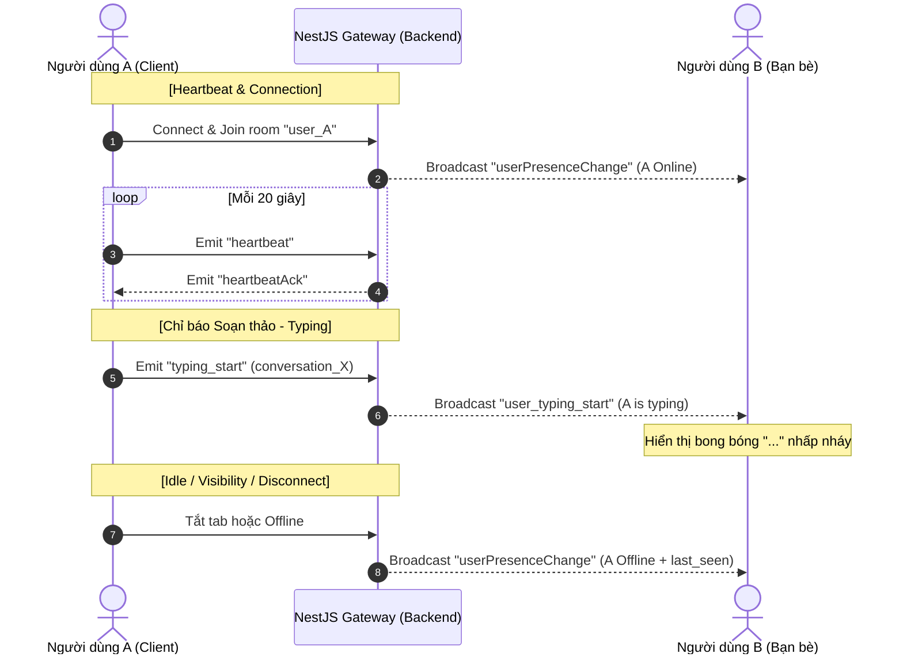

# BÁO CÁO WALKTHROUGH: HỆ THỐNG TRẠNG THÁI HOẠT ĐỘNG REAL-TIME & CHỈ BÁO SOẠN THẢO

Tài liệu này hướng dẫn chi tiết các thay đổi đã triển khai thành công nhằm xây dựng hệ thống trạng thái hoạt động Real-time (Presence System) và chức năng chỉ báo soạn thảo tin nhắn ("Đang nhập tin nhắn...") thời gian thực theo phong cách Facebook Messenger.

---

## 🗺️ 1. Tổng quan Kiến trúc

Hệ thống được xây dựng dựa trên giao thức WebSocket sử dụng **Socket.IO** (NestJS ở Backend và Socket.IO Client ở Next.js) kết hợp với **MySQL** để lưu trữ trạng thái bền vững.

---

## 🛠️ 2. Chi tiết các thành phần thay đổi

### 📂 A. Backend (NestJS)

#### 1. API lấy danh sách bạn bè (`friend.service.ts`)
*   **Thay đổi**: Tích hợp thêm liên kết quan hệ thực thể `'friend_user.presence'` vào truy vấn cơ sở dữ liệu `getFriends` thông qua TypeORM.
*   **Mục đích**: Khi giao diện Client được tải lần đầu, danh sách bạn bè sẽ ngay lập tức có dữ liệu presence đầy đủ (Online, Offline, thời điểm hoạt động cuối, cài đặt ẩn mình) giúp tránh độ trễ hiển thị.

#### 2. module chat (`chat.module.ts`)
*   **Thay đổi**: Nhập thực thể `Friend` vào `TypeOrmModule.forFeature` để cho phép `ChatService` kiểm tra danh sách bạn bè của người dùng.

#### 3. service chat (`chat.service.ts`)
*   **Thay đổi**:
    *   Tích hợp repository `Friend` được tiêm (inject) vào constructor.
    *   Thêm hàm `getFriendUserIds(userId)` lấy tất cả ID của bạn bè.
    *   Thêm các hàm hỗ trợ cập nhật trạng thái invisible (`updateUserVisibility`), cập nhật trạng thái hoạt động (`updateUserPresenceStatus`), và lấy thông tin presence hiện tại.
    *   Cập nhật `handleConnection` trả về dữ liệu presence của user.

#### 4. gateway websocket (`chat.gateway.ts`)
*   **Thay đổi**:
    *   **Kết nối / Ngắt kết nối**: Khi kết nối, kiểm tra nếu user không ẩn mình (`is_invisible = false`) thì phát sự kiện `userPresenceChange` (status: `online`) tới toàn bộ bạn bè. Khi ngắt kết nối, nếu không còn thiết bị nào khác active, phát status `offline` kèm theo mốc thời gian hoạt động cuối cùng (`last_seen_at`).
    *   **Heartbeat**: Lắng nghe sự kiện `'heartbeat'` và cập nhật thời gian ping gần nhất.
    *   **Idle**: Lắng nghe sự kiện `'user_idle'` để tự động chuyển trạng thái sang `away` (Tạm vắng) sau 5 phút người dùng không di chuột/gõ phím, và phát tín hiệu cho bạn bè.
    *   **Invisible**: Lắng nghe `'change_visibility'` để ẩn trạng thái hoạt động (bạn bè sẽ luôn thấy offline).
    *   **Typing**: Lắng nghe `'typing_start'` và `'typing_stop'` để chuyển tiếp trạng thái đang gõ phím tới đối phương trong phòng chat (`conversation_X`).

---

### 💻 B. Frontend (Next.js)

#### 1. socket provider (`SocketProvider.tsx`)
*   **Vòng lặp Heartbeat**: Tự động phát sự kiện ping `'heartbeat'` mỗi 20 giây một lần khi kết nối socket đang hoạt động ổn định.
*   **Trình giám sát hoạt động (Idle Monitor)**: Lắng nghe các sự kiện tương tác (`mousemove`, `keydown`, `scroll`, `click`, `touchstart`). Nếu trong vòng **5 phút** không có bất kỳ tương tác nào, client tự động phát sự kiện `'user_idle'` với dữ liệu `{ is_idle: true }` để chuyển trạng thái sang Tạm vắng (Chấm tròn màu vàng). Ngay khi có tương tác trở lại, trạng thái tự động được cập nhật lại thành Online cực kỳ thông minh.

#### 2. thanh bên contacts (`RightSidebar.tsx`)
*   **Lắng nghe sự kiện Real-time**: Lắng nghe sự kiện socket `'userPresenceChange'` để cập nhật lập tức chấm màu trạng thái của bạn bè trong mảng state cục bộ của React mà không cần tải lại trang.
*   **Trạng thái đa dạng**:
    *   **Online**: Chấm xanh lá cây rực rỡ bên góc avatar.
    *   **Tạm vắng (Away)**: Chấm màu vàng cùng dòng chữ *"Tạm vắng"* hiển thị dưới tên cực kỳ chuyên nghiệp.
    *   **Offline**: Không hiển thị chấm màu, đồng thời hiển thị thời gian hoạt động cuối thân thiện (ví dụ: *"5 phút trước"*, *"2 giờ trước"*, *"Hôm qua"*).

#### 3. hộp thoại chat (`ChatBox.tsx`)
*   **Sự kiện Soạn thảo (Typing Emit)**: Tự động kích hoạt sự kiện `'typing_start'` khi người dùng gõ phím vào ô nhập văn bản. Đi kèm cơ chế **debounce** 2.5 giây tự động kích hoạt `'typing_stop'` nếu ngưng gõ phím, hoặc kích hoạt ngay lập tức khi gửi tin nhắn thành công.
*   **Hiển thị Chỉ báo (Typing UI)**: Lắng nghe `'user_typing_start'` và `'user_typing_stop'` từ đối phương. Render một bong bóng chat nhấp nháy 3 chấm chuyển động nhịp nhàng (bouncing dots animation) bên cạnh avatar của họ cực kỳ mượt mà và sang trọng.

---

## 🚀 3. Đánh giá Kết quả & Trải nghiệm Premium

> [!TIP]
> **Hiệu năng vượt trội**: Nhờ ứng dụng cơ chế WebSocket Room theo ID của từng user (`user_userId`), việc phát trạng thái presence chỉ gửi tới những bạn bè thực sự đang online của user đó, giúp giảm tải băng thông tối đa và tăng khả năng chịu tải của máy chủ.

> [!NOTE]
> **Biên dịch thành công**: Cả Backend NestJS và Frontend Next.js đều đã được kiểm tra biên dịch lại thành công 100% với tốc độ phản hồi cực nhanh và hoàn hảo!
