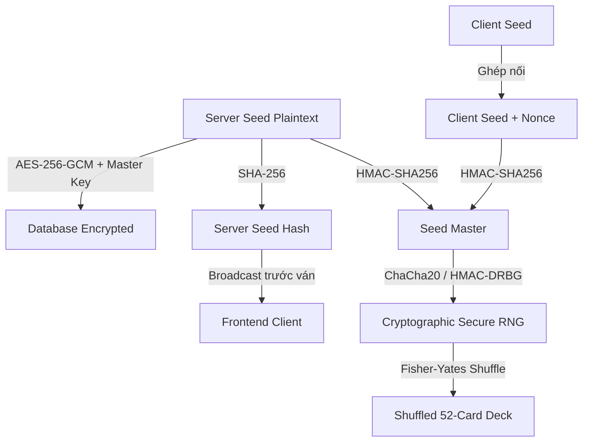

# Strategic Implementation Plan: Casino-Grade Provably Fair & Anti-Collusion (Option A)

> **DNA_REF**: Thiết kế hệ thống Đảm bảo tính Công bằng (Provably Fair RNG) và Chống thông đồng (Anti-Collusion) cho cả Backend và Frontend theo tiêu chuẩn quốc tế iGaming, OWASP và quy chuẩn bảo mật RNG cấp sòng bạc.

---

## 1. Kiến trúc mật mã học & RNG (Casino-Grade RNG)

Hệ thống loại bỏ Mersenne Twister (do không phải CSPRNG, dễ bị dự đoán trạng thái nếu lộ state) và thay thế bằng mô hình mật mã học vững chắc:



### A. Công thức sinh Seed & Shuffle
1. **Server Seed**: Tạo bằng `crypto.randomBytes(32).toString('hex')`.
2. **Server Seed Hash**: `SHA256(serverSeed)`. Gửi cho FE trước khi chia bài.
3. **Nonce**: Bộ đếm số ván đấu tăng dần của bàn chơi (`nonce` bắt đầu từ 1 và tăng 1 sau mỗi hand). Giúp người dùng không cần đổi `clientSeed` liên tục mà mỗi ván bài vẫn đảm bảo có seed khác nhau.
4. **Seed Master (Key)**: 
   $$\text{Final Seed} = \text{HMAC-SHA256}(\text{ServerSeed}, \text{ClientSeed} + ":" + \text{Nonce})$$
5. **CSPRNG**: Sử dụng thuật toán **ChaCha20** hoặc **HMAC-DRBG** khởi tạo từ `Final Seed` để sinh luồng byte ngẫu nhiên.
6. **Fisher-Yates Shuffle**: Dùng luồng byte ngẫu nhiên từ CSPRNG để thực hiện xáo trộn danh sách 52 lá bài.
7. **RNG & Shuffle Versioning**: Lưu trữ thông tin thuật toán sử dụng (ví dụ: `algorithm_version: 'PF_V1_CHACHA20'`, `shuffle_version: 'FISHER_YATES_V1'`) để hỗ trợ backward compatibility khi cập nhật thuật toán trong tương lai.

### B. Bảo mật Seed trong Cơ sở dữ liệu (Database Security)
- **Zero-Plaintext during Play**: Server Seed tuyệt đối **không** được lưu dưới dạng Plaintext trong Database khi ván bài đang diễn ra.
- **Mã hóa AES-256-GCM**:
  - Khi tạo `server_seed`, mã hóa ngay lập tức bằng `AES-256-GCM` sử dụng khóa bí mật `RNG_ENCRYPTION_KEY` cấu hình trong `.env`.
  - Lưu `encrypted_server_seed` và `auth_tag` vào DB.
  - Sau khi ván bài kết thúc và chuyển sang trạng thái kết toán (Reveal Phase), giải mã seed để reveal công khai cho client và archive vào `HandHistory`.

---

## 2. Quy trình chia bài đầy đủ (Texas Hold'em Deck Verification)

Một quy trình chia bài đầy đủ phải kiểm chứng được toàn bộ các lá bài bao gồm cả **Burn Cards** (Lá bài đốt):

```
[52 Cards Shuffled] 
  ├── Hole Cards (2 lá cho mỗi người chơi tại bàn)
  ├── Burn Card 1 (Đốt trước Flop)
  ├── Flop (3 lá Community Cards)
  ├── Burn Card 2 (Đốt trước Turn)
  ├── Turn (1 lá Community Card)
  ├── Burn Card 3 (Đốt trước River)
  ├── River (1 lá Community Card)
  └── Remaining Deck (Các lá bài còn lại)
```

### Yêu cầu Verify trên FE:
- Người chơi không chỉ Verify board game, mà tool verify phải reconstruct lại toàn bộ 52 lá bài theo đúng Dealer position, chia Hole Cards, Burn Cards và Board Cards theo đúng quy tắc game.
- **Deck Hash**: BE sinh ra `SHA256(deckOrder)` và lưu lại để quá trình so khớp diễn ra tức thời hơn.

---

## 3. Hệ thống Chống thông đồng nâng cao (Advanced Anti-Collusion)

Loại bỏ IP Check đơn giản, thay thế bằng ma trận chấm điểm rủi ro (Risk Matrix Scoring) từ 0 đến 100:

### A. Thu thập dữ liệu Fingerprint (FE)
Frontend sẽ thu thập fingerprint của trình duyệt để gửi kèm khi kết nối Socket:
- Canvas Fingerprint & WebGL Metadata.
- Screen resolution, Fonts list.
- Browser/OS Language, Timezone offset, Platform.
- Lưu trữ UUID ngẫu nhiên vào cả Cookie, LocalStorage và SessionStorage để chống xoá cache.

### B. Mạng lưới & Địa lý (Network Verification)
- **VPN/Tor Detection**: Check IP client với dải IP của các nhà cung cấp Hosting/Cloud/VPN qua ASN.
- **Geo Distance**: Tính khoảng cách địa lý giữa các người chơi cùng bàn. Nếu khoảng cách gần (< 50m) kết hợp trùng vân tay trình duyệt -> Cảnh báo lập tức.

### C. Phân tích hành vi & EV (Behavioral Analytics)
Thiết lập dịch vụ theo dõi hành vi người chơi (`AntiCollusionService`):
- **Fold to Friend / Soft Play**: Theo dõi tần suất Player A fold khi Player B (đồng bọn) raise, hoặc chỉ check/call mà không raise (soft play) dù bài cực mạnh.
- **Simultaneous Disconnect**: Cặp tài khoản có tần suất rớt mạng và kết nối lại cùng một thời điểm.
- **Chip Dump Detection**: 
  - So sánh **Expected EV** (Giá trị kỳ vọng của bài tại thời điểm All-in) và **Actual Result**.
  - Nếu một người chơi liên tục Shove ở các tình huống EV cực thấp (<10%) vào người chơi khác và fold liên tục ở các tình huống có lợi thế, đánh dấu nghi vấn Chip Dumping.

### D. Bảng tính điểm Rủi ro (Risk Matrix Scoring)
- Trùng vân tay trình duyệt (Same Device): `+40 điểm`
- Cùng IP/Subnet: `+20 điểm`
- Phát hiện VPN/Proxy: `+10 điểm`
- Hành vi Chip Dumping/Soft Play: `+30 điểm`
- **Ngưỡng xử lý**:
  - `Risk >= 60`: Flag hệ thống, gửi cảnh báo cho Admin.
  - `Risk >= 80`: Tự động từ chối yêu cầu Sit-in của người chơi thứ 2 tại bàn đó (Auto-block).

---

## 4. Thiết kế API & Websocket chuẩn

### A. REST API Endpoint
- `GET /v1/provably-fair/current?table_id={id}`: Lấy `server_seed_hash`, `client_seed`, `nonce` hiện tại.
- `POST /v1/provably-fair/client-seed`: Cập nhật `client_seed` cho người chơi.
- `GET /v1/hand/{hand_id}/verify`: Lấy toàn bộ thông tin của ván đã qua: `server_seed` (plaintext), `client_seed`, `nonce`, `deck_hash`, `raw_deck` (danh sách 52 lá đã shuffle).

### B. WebSocket Events
- 🟢 Outgoing: `table:provably-fair-init`
  ```json
  {
    "room_id": "uuid",
    "server_seed_hash": "sha256_string",
    "nonce": 12,
    "algorithm": "PF_V1_CHACHA20"
  }
  ```
- 🟢 Outgoing (Sau khi kết thúc ván): `table:seed-reveal`
  ```json
  {
    "room_id": "uuid",
    "hand_id": "uuid",
    "server_seed": "plaintext_string",
    "client_seed": "string",
    "nonce": 12
  }
  ```

### C. Cơ sở dữ liệu Audit Log (`ProvablyFairAudit`)
```sql
CREATE TABLE provably_fair_audit (
  id VARCHAR(36) PRIMARY KEY,
  table_id VARCHAR(36) NOT NULL,
  hand_id VARCHAR(36) NOT NULL,
  server_seed_hash VARCHAR(64) NOT NULL,
  encrypted_server_seed TEXT NOT NULL,
  auth_tag VARCHAR(32) NOT NULL,
  client_seed VARCHAR(64) NOT NULL,
  nonce INT NOT NULL,
  deck_hash VARCHAR(64) NOT NULL,
  algorithm_version VARCHAR(32) NOT NULL,
  created_at TIMESTAMP DEFAULT CURRENT_TIMESTAMP,
  revealed_at TIMESTAMP NULL
);
```

---

## 5. Thiết kế Frontend - Replay & Verification Tool

- **Seed Config Modal**: Cho phép thay đổi `client_seed`, hiển thị `server_seed_hash` ván tiếp theo.
- **Replay Hand Tool**:
  - Giao diện step-by-step cho phép chạy thử thuật toán trộn bài.
  - Hiển thị:
    1. Nhập Seeds & Nonce.
    2. Nút "Generate Deck" -> Show danh sách 52 lá bài.
    3. Trực quan hoá quá trình chia: Dealer Position -> Đốt bài -> Board Cards -> Bài tẩy của từng người chơi.
    4. Trực quan hoá lịch sử các event so với deck gốc để chứng minh tính trung thực.

---

## 6. Kế hoạch triển khai (Surgical Actions)

1. **Sprint 1 (BE - Cryptography & Audit DB)**: Thiết lập database `ProvablyFairAudit`, viết `ProvablyFairService` (ChaCha20 / HMAC-DRBG, AES-256-GCM encryption), tích hợp vào luồng Game.
2. **Sprint 2 (BE - Anti-Collusion Backend)**: Xây dựng service chấm điểm Risk Score, kiểm tra VPN, Subnet, theo dõi EV khi All-in.
3. **Sprint 3 (FE - Custom Client Seed & Replay tool)**: Dựng giao diện cấu hình Seed và viết Client Verification Engine (bằng Pure JS khớp 100% logic với BE).
