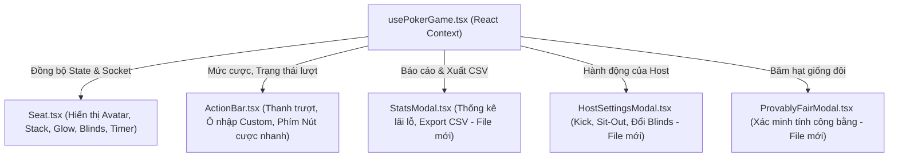

# 📝 Kế hoạch Ghép Nối & Tích Hợp Frontend Poker Game (Frontend Integration Plan)

Tài liệu này phác thảo kế hoạch chi tiết để tích hợp các tính năng Real-time WebSocket, REST API, bộ cược thông minh (Bet Slider & ActionBar), cơ chế bảo vệ ngắt kết nối (Disconnect Protection), tính năng quản trị phòng Custom và hệ thống xác minh tính công bằng (Provably Fair) trên Poker-Game FE.

---

## 📂 SƠ ĐỒ MỤC TIÊU CÁC FILE CẦN CHỈNH SỬA & THÊM MỚI



*   `FE/app/[locale]/poker-game/table/[id]/components/hooks/usePokerGame.tsx`: Quản lý kết nối socket, đệm sự kiện, đồng bộ hóa state và gọi API.
*   `FE/app/[locale]/poker-game/table/[id]/components/table/Seat.tsx`: Hiển thị thông tin người chơi, Glow glow viền khi tới lượt, Dealer/Blind chips, vòng đếm ngược Timer.
*   `FE/app/[locale]/poker-game/table/[id]/components/hero/ActionBar.tsx`: Trải nghiệm đặt cược (slider kéo thả, gõ số custom, phím cược nhanh, nút xác nhận duy nhất).
*   `FE/app/[locale]/poker-game/table/[id]/components/settings/HostSettingsModal.tsx` *(File mới)*: Quản trị bàn chơi dành cho chủ phòng.
*   `FE/app/[locale]/poker-game/table/[id]/components/settings/StatsModal.tsx` *(File mới)*: Báo cáo tài chính phiên cược và xuất CSV.
*   `FE/app/[locale]/poker-game/table/[id]/components/ui/ProvablyFairModal.tsx` *(File mới)*: Giao diện xác thực hạt giống đôi.

---

## ⚡ PHẦN 1: TÍCH HỢP WEBSOCKET & ĐỒNG BỘ TRẠNG THÁI (STATE SYNC)

### 1. Khởi tạo Socket và Lắng nghe sự kiện trong `usePokerGame.tsx`
*   Sử dụng thư viện `socket.io-client` để thiết lập kết nối tới BE Gateway.
*   Quản lý vòng đời socket trong `useEffect` gắn liền với `tableId`.

```typescript
// Mã giả cấu trúc lắng nghe sự kiện WebSocket trong usePokerGame.tsx
useEffect(() => {
  if (!tableId) return;

  const socket = io(process.env.NEXT_PUBLIC_WS_URL || "", {
    query: { roomId: tableId },
    transports: ["websocket"],
  });

  socketRef.current = socket;

  // 1. Đăng ký nhận luồng bàn chơi
  socket.emit("table:subscribe", { room_id: tableId });

  // 2. Đồng bộ trạng thái toàn cục khi vào bàn hoặc có thay đổi lớn
  socket.on("table:state", (data: TableStatePayload) => {
    setTableName(data.room_name);
    setGameStage(data.game_stage);
    setCommunityCards(data.community_cards);
    setPot(data.total_pot.toString());
    setPlayers(data.seats);
    // Vị trí Dealer, SB, BB
    setDealerSeat(data.dealer_seat);
    setSmallBlindSeat(data.small_blind_seat);
    setBigBlindSeat(data.big_blind_seat);
  });

  // 3. Nhận riêng bài tẩy của Hero (Bảo mật Anti-Cheat)
  socket.on("table:private-cards", (data: { pocket_cards: string[] }) => {
    // Chỉ cập nhật bài tẩy vào Hero Player trong mảng players
    setPlayers(prev => prev.map(p => p.isHero ? { ...p, cards: data.pocket_cards } : p));
  });

  // 4. Lắng nghe hành động của các ghế chơi
  socket.on("table:action-recorded", (data: ActionRecordedPayload) => {
    // Cập nhật Stack, Bet cược hiện tại của ghế đó, chạy âm thanh hành động
    playActionSound(data.action_type);
    setPlayers(prev => prev.map(p => p.seatIndex === data.seat_number ? { 
      ...p, 
      chips: data.new_stack.toString(), 
      lastAction: data.action_type 
    } : p));
  });

  // 5. Lắng nghe chuyển lượt hành động (Turn Change)
  socket.on("table:turn-change", (data: TurnChangePayload) => {
    setCurrentTurnSeat(data.seat_number);
    setMinRaise(data.min_raise);
    setMaxRaise(data.player_stack); // Lượng tối đa có thể raise bằng stack hiện có
    // Reset bộ đếm giờ lượt suy nghĩ
    resetTimer(data.time_limit || 30);
  });

  return () => {
    socket.disconnect();
  };
}, [tableId]);
```

---

## 👤 PHẦN 2: THIẾT KẾ PLAYER STATUS & SEAT COMPONENTS (`Seat.tsx`)

Thành phần `Seat.tsx` hiện tại chỉ hiển thị đơn giản. Chúng ta sẽ nâng cấp giao diện ghế ngồi đạt tiêu chuẩn sòng bài cao cấp:

### 1. Sơ đồ Giao diện Ghế ngồi (Seat Layout Design)
```text
+--------------------------------------------------+
|                  Viền Sáng Glow                  |
|                 (Khi đến lượt đi)                |
|  +--------------------------------------------+  |
|  | [Avatar Tròn]   [Tên Người Chơi]           |  |
|  |                 [Stack Size: 1.25M chips]  |  |
|  +--------------------------------------------+  |
|                                                  |
|   [Lá bài Tẩy 1] [Lá bài Tẩy 2]  (Nếu active)    |
|   [Nhãn Action]  (FOLD / CHECK / CALL nhấp nháy) |
|   [Chip Blinds]  (D / SB / BB tròn màu sắc)      |
+--------------------------------------------------+
```

### 2. Các điểm logic ghép nối trong `Seat.tsx`:
*   **Thông tin cố định:** Render Avatar (Dicebear SVG), Tên rút gọn, và số Stack phỉnh (`chips` được format đẹp mắt qua `formatChipsVal`).
*   **Viền sáng Glow chuyển động (Turn Glow):**
    *   Nếu `seatIndex === currentTurnSeat`, thêm lớp CSS hiệu ứng viền phát sáng (Glow Pulse / Keyframe border gradient) chạy xung quanh Container của ghế.
*   **Vòng tròn đếm ngược (Action Progress Bar):**
    *   Vẽ một đường viền tròn SVG bao quanh Avatar đại diện.
    *   Sử dụng tỷ số `timerVal / maxTimerVal` để giảm dần vòng cung (Stroke Dashoffset) từ màu xanh lá sang màu vàng, đỏ khi sắp hết giờ 30s.
*   **Nhãn Blind / Dealer:**
    *   Nếu `seatIndex === dealerSeat`: Hiển thị vòng tròn nhỏ chữ **"D"** màu trắng/vàng.
    *   Nếu `seatIndex === smallBlindSeat`: Hiển thị vòng chữ **"SB"** màu xanh dương.
    *   Nếu `seatIndex === bigBlindSeat`: Hiển thị vòng chữ **"BB"** màu đỏ.

---

## 🎚️ PHẦN 3: BỘ CƯỢC THÔNG MINH & THANH TRƯỢT (`ActionBar.tsx`)

Thực hiện gom ô nhập số cược custom và thanh trượt làm một thể đồng nhất và điều khiển thông minh theo yêu cầu thiết kế UI/UX.

### 1. Luồng hoạt động dữ liệu hai chiều (Two-way Binding Slider)
*   **State kiểm soát:** `raiseAmount` (Số lượng chips muốn cược thêm).
*   **Liên kết trượt:**
    *   `min` của Slider = `minRaise`.
    *   `max` của Slider = `maxRaise` (All-in).
    *   `step` = `smallBlind` (đảm bảo cược tăng theo cấp số mù nhỏ nhất).
*   **Khi kéo Slider:** Sự kiện `onChange` cập nhật `raiseAmount`, giá trị trong ô Input Custom tự động cập nhật theo.
*   **Khi nhập ô Input Custom:** Sự kiện `onBlur` hoặc `onChange` kiểm tra giá trị nhập:
    *   Nếu nhỏ hơn `minRaise`: Tự động gán bằng `minRaise`.
    *   Nếu lớn hơn `maxRaise`: Tự động gán bằng `maxRaise`.
    *   Cập nhật `raiseAmount`, thanh trượt tự động trượt tới tỷ lệ vị trí tương ứng.

### 2. Phân hệ các phím cược nhanh (Quick Bets Buttons)
Đặt 4 nút bấm chọn nhanh phía trên thanh trượt: `1/2 POT`, `3/4 POT`, `POT`, và `ALL-IN`.
*   Khi click chọn: Tính toán lượng cược ngay trên Client dựa theo các công thức đã định nghĩa ở Phần 9 của Gameplay Plan.
    *   *Ví dụ cược POT:*
        ```typescript
        const handleQuickBetPot = () => {
          const callAmount = currentHighestBet - heroCurrentBet;
          const potAfterCall = currentPotSize + callAmount;
          const targetBet = currentHighestBet + potAfterCall;
          setRaiseAmount(Math.min(targetBet, heroStack));
        };
        ```

### 3. Nút Xác Nhận Duy Nhất & Ẩn Hiện Thông Minh
*   **Trạng thái Ẩn/Hiện:**
    *   Mặc định khi đến lượt đi của Hero, chỉ hiển thị 3 nút cơ bản: `FOLD`, `CHECK/CALL`, `RAISE`.
    *   Thanh trượt cược và ô nhập Custom **hoàn toàn ẩn**.
    *   Khi người chơi bấm vào nút `RAISE` lớn, thanh trượt, phím nhanh cược Pot và ô nhập mới hiển thị trượt lên (Slide up transition).
*   **Nút xác nhận duy nhất:**
    *   Loại bỏ nút "Raise: Custom" màu vàng ở góc trái.
    *   Nút hành động to ở góc dưới cùng bên phải sẽ biến đổi động nhãn văn bản:
        *   Nếu kéo trượt ở mức `raiseAmount`: Hiển thị `RAISE [formatChipsVal(raiseAmount)]` (ví dụ: `RAISE 250K`).
        *   Nếu kéo trượt chạm mốc `maxRaise`: Hiển thị `RAISE [formatChipsVal(raiseAmount)] (ALL-IN)`.
    *   Khi bấm nút này, thực hiện đóng gói dữ liệu gửi API/Socket và ẩn thanh trượt cược đi.

---

## 🔌 PHẦN 4: CƠ CHẾ BẢO VỆ MẤT KẾT NỐI (DISCONNECT PROTECTION)

*   **Lắng nghe trạng thái ngắt kết nối Socket:**
    ```typescript
    socket.on("disconnect", () => {
      showToast("Mất kết nối mạng! Đang tìm cách kết nối lại...", "warning");
      setIsConnecting(true); // Hiển thị overlay mờ phủ lên bàn chơi
    });
    ```
*   **Kết nối lại thành công:**
    ```typescript
    socket.on("reconnect", () => {
      showToast("Đã kết nối lại bàn chơi thành công!", "success");
      setIsConnecting(false);
      // Gửi yêu cầu lấy trạng thái mới nhất ngay lập tức
      socket.emit("table:subscribe", { room_id: tableId });
    });
    ```
*   **Đếm ngược 30 giây bảo vệ (Disconnect Protection UI):**
    *   Nếu Hero bị mất mạng, trên ghế chơi của Hero hiển thị nhãn **"MẤT MẠNG - [Số giây]s"** đếm ngược từ 30 về 0 để các người chơi khác tại bàn biết và kiên nhẫn chờ đợi.

---

## ⚙️ PHẦN 5: CHỦ PHÒNG & THỐNG KÊ CHI TIẾT (HOST CONTROLS & STATS REPORT)

### 1. Giao diện Quản trị của Chủ phòng (`HostSettingsModal.tsx`)
Hiển thị nút "Quản lý bàn" (chỉ hiển thị với user có ID trùng với `owner_id` của phòng Custom). Khi bấm vào, mở Modal có các tính năng:
*   **Thay đổi Small Blind:** Dropdown chọn các mức `50 / 100 / 200 / ...` hoặc nhập Custom. Bấm xác nhận sẽ gửi request `POST /api/v1/rooms/:id/config`.
*   **Danh sách ghế chơi hiện tại (Seat List):** Hiển thị tên người chơi ở mỗi ghế kèm 2 nút hành động:
    *   Nút **"Mời ra" (Kick)**: Gửi request `POST /api/v1/rooms/:id/kick`.
    *   Nút **"Đi vắng" (Force Sit-out)**: Gửi request `POST /api/v1/rooms/:id/force-sit-out`.
*   **Nạp/Trừ phỉnh nhanh:** Cho phép nhập số lượng phỉnh cược và chọn ghế để cộng/trừ trực tiếp phỉnh thông qua `POST /api/v1/rooms/:id/modify-stack`.

### 2. Giao diện Báo cáo tài chính & Xuất CSV (`StatsModal.tsx`)
Bàn chơi hỗ trợ nút "Báo Cáo Phiên Chơi" hiển thị bảng thống kê:
*   **Truy vấn dữ liệu:** Gọi API `GET /api/v1/rooms/:id/stats` để render bảng:
    | Tên | Ghế | Tổng Mua (Buy-in) | Còn Lại (Stack) | Đã Rút (Cashout) | Lãi/Lỗ ròng (P&L) |
    | :--- | :--- | :--- | :--- | :--- | :--- |
    | GIANG | 1 | 500,000 | 1,245,000 | 0 | +745,000 |
    | LUCKY | 3 | 200,000 | 0 | 85,000 | -115,000 |
*   **Nút "Xuất file Excel/CSV":**
    *   Thực hiện mở liên kết trực tiếp tới endpoint xuất file của Backend: `window.open('/api/v1/rooms/' + tableId + '/stats/export')`.
    *   Trình duyệt nhận file CSV mã hóa UTF-8 BOM và tự động tải xuống thiết bị người dùng.

---

## 🎲 PHẦN 6: GIAO DIỆN XÁC MINH CÔNG BẰNG (PROVABLY FAIR UI)

Để người chơi có thể kiểm tra tính ngẫu nhiên của bộ bài chia:
*   **Vị trí hiển thị:** Đặt nút lá chắn bảo mật kèm nhãn "Provably Fair" ở thanh menu phụ của bàn chơi.
*   **UI Modal gồm 2 Tab:**
    *   **Tab 1: Ván hiện tại (Active Hand):** Hiển thị mã băm công khai `Server Seed Hash` thu được từ sự kiện `table:hand-started`.
    *   **Tab 2: Xác minh ván trước (Verify Previous Hand):**
        *   Cho phép người chơi xem lại: `Server Seed (Plain text)`, `Client Seed(s)` và `Combined Seed (HMAC-SHA512)` của ván bài vừa kết thúc.
        *   Cung cấp một đoạn mã Javascript/Python mẫu ngay trên UI và nút "Kiểm tra ngay" để tự động chạy thuật toán Fisher-Yates đối chiếu thứ tự bộ bài thực tế đã chia.
