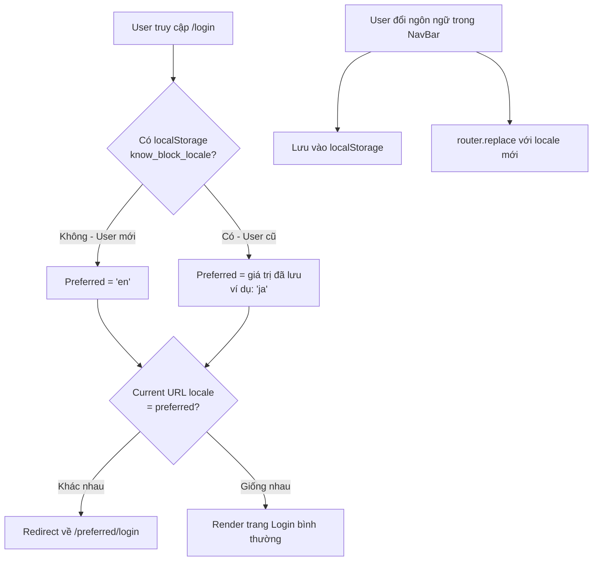

# Plan: Ngôn ngữ thông minh cho các trang Auth (Login / Register / Forgot Password)

## 🎯 Mục tiêu

| Đối tượng | Hành vi mong muốn |
|---|---|
| **User chưa từng đăng kí / đăng nhập** | Mặc định hiển thị **English** (`en`) |
| **User đã từng dùng app và đã chọn ngôn ngữ** | 3 trang auth hiển thị theo **ngôn ngữ họ đã chọn trước đó** |

---

## 🔍 Phân tích hiện trạng

### Cơ chế locale hiện tại
- Project dùng **`next-intl`** với URL-based locale: `/en/login`, `/vi/login`, `/ja/login`
- `defaultLocale = 'vi'` trong `routing.ts` → user mới vào sẽ thấy tiếng Việt mặc định
- Khi user đổi ngôn ngữ trong NavBar, `router.replace(pathname, { locale: newLocale })` chỉ **thay đổi URL**, **không lưu** preference vào bất kỳ storage nào
- Khi reload trang hoặc mở tab mới, locale quay về `defaultLocale`

### Vấn đề cần giải quyết
1. **User mới** → cần redirect về `/en/...` thay vì `/vi/...`
2. **User cũ có saved preference** → cần đọc preference và redirect đúng locale
3. **Khi user đổi ngôn ngữ** → cần persist preference vào localStorage/cookie

---

## 🗺️ Kiến trúc giải pháp

### Storage Layer
Lưu locale preference vào **`localStorage`** với key `know_block_locale`.

Lý do chọn localStorage thay vì cookie:
- Không cần server-side đọc (auth pages đều là Client Component)
- Đơn giản hơn, không cần middleware phức tạp
- Phù hợp với use-case: chỉ cần đọc khi user vào trang auth

> [!NOTE]
> `next-intl` cũng tự lưu cookie `NEXT_LOCALE` khi dùng middleware. Ta sẽ kết hợp đọc cả hai.

---

## 📋 Chi tiết các bước triển khai

### Bước 1: Lưu preference khi user đổi ngôn ngữ

**File:** `FE/components/layout/NavBar.tsx` — hàm `changeLanguage`

```diff
const changeLanguage = (newLocale: string) => {
  setIsLangOpen(false);
+ localStorage.setItem("know_block_locale", newLocale);
  router.replace(pathname, { locale: newLocale });
};
```

### Bước 2: Tạo utility hook `usePreferredLocale`

**File mới:** `FE/hooks/usePreferredLocale.ts`

```ts
// Đọc locale preference theo thứ tự ưu tiên:
// 1. localStorage (user đã từng chọn)
// 2. 'en' (mặc định cho user mới)
export function getPreferredLocale(): string {
  if (typeof window === "undefined") return "en";
  return localStorage.getItem("know_block_locale") || "en";
}
```

### Bước 3: Tạo Auth Locale Guard Component

**File mới:** `FE/components/auth/AuthLocaleRedirect.tsx`

Logic:
```
1. Đọc locale hiện tại từ URL params (`/[locale]/login`)
2. Đọc preferred locale từ localStorage
3. Nếu khác nhau → redirect đến đúng locale
4. Nếu giống nhau → render children bình thường
```

```tsx
"use client";
export function AuthLocaleRedirect({ children, currentLocale }) {
  const router = useRouter();
  
  useEffect(() => {
    const preferred = getPreferredLocale(); // "en" nếu mới
    if (preferred !== currentLocale) {
      router.replace(`/${preferred}/login`); // redirect
    }
  }, []);

  return <>{children}</>;
}
```

### Bước 4: Wrap layout của auth group

**File:** `FE/app/[locale]/(auth)/layout.tsx` *(tạo mới nếu chưa có)*

```tsx
import { AuthLocaleRedirect } from "@/components/auth/AuthLocaleRedirect";

export default async function AuthLayout({ children, params }) {
  const { locale } = await params;
  return (
    <AuthLocaleRedirect currentLocale={locale}>
      {children}
    </AuthLocaleRedirect>
  );
}
```

### Bước 5: Cập nhật defaultLocale

**File:** `FE/i18n/routing.ts`

```diff
export const routing = defineRouting({
  locales: ['en', 'ja', 'vi'],
- defaultLocale: 'vi'
+ defaultLocale: 'en'
});
```

> [!WARNING]
> Thay đổi `defaultLocale` ảnh hưởng đến **toàn bộ app**, không chỉ auth pages. Cần cân nhắc kỹ hoặc chỉ xử lý redirect ở auth layout thay vì đổi global config.

---

## 🔄 Flow hoàn chỉnh



---

## 🗂️ Danh sách file cần thay đổi

| File | Hành động | Mức độ |
|---|---|---|
| `FE/i18n/routing.ts` | Đổi `defaultLocale: 'en'` | Thay đổi nhỏ |
| `FE/components/layout/NavBar.tsx` | Thêm `localStorage.setItem` khi đổi ngôn ngữ | Thay đổi nhỏ |
| `FE/hooks/usePreferredLocale.ts` | **Tạo mới** — utility đọc preferred locale | Mới |
| `FE/components/auth/AuthLocaleRedirect.tsx` | **Tạo mới** — client component redirect | Mới |
| `FE/app/[locale]/(auth)/layout.tsx` | **Tạo mới** — auth group layout | Mới |

---

## ⚠️ Lưu ý & Rủi ro

> [!CAUTION]
> Đổi `defaultLocale: 'vi'` → `'en'` sẽ thay đổi URL mặc định của **toàn bộ app**, không chỉ auth. Nếu không muốn ảnh hưởng app chính, ta **chỉ xử lý redirect ở auth layout** mà không đổi global config.

> [!TIP]
> Sau khi user đăng nhập thành công, nếu họ được redirect về `/home`, locale trong URL sẽ tự động là locale họ đang dùng ở trang login, không cần xử lý thêm.

> [!NOTE]
> `next-intl` v4 có thể tự đọc cookie `NEXT_LOCALE` qua middleware. Nếu muốn giải pháp server-side hoàn toàn, có thể kết hợp với middleware nhưng sẽ phức tạp hơn nhiều. Approach localStorage đơn giản và đủ dùng cho yêu cầu này.
