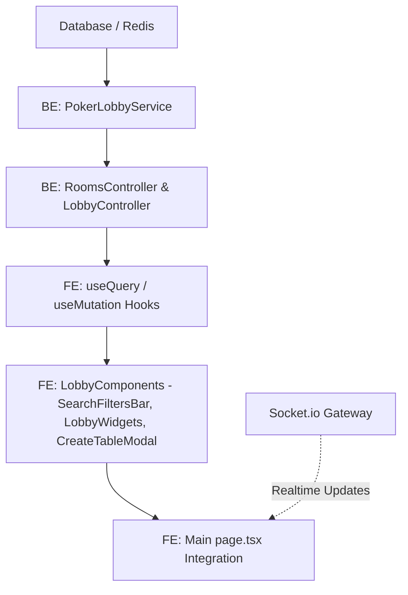

# PLAN - Kế hoạch Kiểm thử Sảnh Poker Lobby (Phase 1, 2, 3)

> [!IMPORTANT]
> **Mục tiêu chính**:
> Xác minh tính chính xác, đầy đủ chức năng và mức độ hoàn thiện giao diện của sảnh Poker Lobby sau khi refactor/redesign ở Phase 1 (Backend APIs), Phase 2 (Các Component Frontend), và Phase 3 (Tích hợp API/Socket vào trang chủ). 
> Đảm bảo toàn bộ hệ thống màu sắc, cấu trúc layout tuân thủ chuẩn thiết kế cao cấp (Casino Premium) dựa theo màu base của `FE/app/poker-game/page.tsx`.

---

## 🎯 1. Mục tiêu Kiểm thử (Testing Goals)

1. **Chức năng chính xác**: Đảm bảo tất cả các API, luồng nghiệp vụ tạo phòng, tìm bàn chơi nhanh, nhận chip miễn phí, và cập nhật realtime qua Socket.io hoạt động ổn định.
2. **Giao diện chuẩn Casino Premium**:
   - Nền tối: `radial-gradient(circle at 50% 0%, #12221b 0%, #060e0a 60%, #020504 100%)`.
   - Màu sắc chủ đạo (Accent Gold): `#F4B942` & `#E0942A` (chữ vàng gold, viền vàng gold, nút gradient vàng gold).
   - Màu chữ base (Cream/Light Beige): `#F7EFDD` với các mức độ mờ (`/40`, `/60`).
   - Màu chất bài đỏ (Red Suits): `#E23744` cho chất cơ (♥) và rô (♦).
   - Màu nền Widget tối: `#0b141d/75` kết hợp viền siêu mỏng `border-white/5` hoặc `border-[#F4B942]/10`.
3. **Hiệu năng & Khả năng đáp ứng (Responsive)**:
   - Đo lường FPS và Ping trên giao diện thực tế.
   - Kiểm tra hiển thị responsive trên thiết bị di động (sự xuất hiện của Bottom Navigation thay vì Sidebar/Desktop layout).
4. **Không có lỗi Code (Zero Lint/Type Error)**: 
   - Không còn các biến thừa (`unused-vars`), import rác, hoặc lỗi kiểu TypeScript.

---

## 🔗 2. Chuỗi Phụ thuộc kiểm thử (Dependency Chains)

Các thành phần cần kiểm tra tính tương thích:
* **API Endpoints:**
  * `GET /api/v1/rooms` (Lấy danh sách phòng công khai + riêng tư kèm filter)
  * `POST /api/v1/rooms` (Tạo phòng với cấu hình nâng cao)
  * `GET /api/v1/lobby/recent` (Lấy danh sách các bàn chơi gần đây nhất của user)
  * `GET /api/v1/lobby/leaderboard` (Bảng xếp hạng tài sản của người chơi)
  * `GET /api/v1/lobby/active-players` (Cao thủ đang chơi để giả lập Friends Online)
  * `POST /api/v1/wallet/free-chips` (Nhận phỉnh miễn phí hàng ngày)
  * `POST /api/v1/rooms/join-request` (Yêu cầu vào phòng)
  * `POST /api/v1/rooms/spectate` (Theo dõi phòng đấu)
* **Socket.io Events:**
  * Lắng nghe `lobby:stats-update` để cập nhật số lượng người online, số bàn chạy, hũ Pot.
  * Lắng nghe `lobby:room-status-changed` để cập nhật số lượng người chơi tại từng bàn realtime.

---

## 📅 3. Kế hoạch Kiểm thử Từng bước (Phase-by-Phase Testing Plan)

### 🔴 Phase 1: Kiểm thử Backend APIs (Unit & Integration)
* **Mục tiêu**: Đảm bảo Backend cung cấp đầy đủ dữ liệu chính xác và xử lý an toàn cho các tác vụ của sảnh.
* **Chi tiết kiểm thử**:
  1. **API Recent Rooms (`/api/v1/lobby/recent`)**: Đảm bảo trả về danh sách các phòng mà user đã từng tham gia gần đây, sắp xếp theo thời gian mới nhất từ `TableSession`.
  2. **API Leaderboard (`/api/v1/lobby/leaderboard`)**: Đảm bảo query đúng top 10 user có ví phỉnh cao nhất, trả về đúng tên, số dư ví, rank tương ứng.
  3. **API Active Players (`/api/v1/lobby/active-players`)**: Lấy danh sách những người chơi khác đang tích cực hoạt động tại các bàn để hiển thị trong mục "Cao thủ đang chơi".
  4. **API Tạo bàn chơi mới (`POST /api/v1/rooms`)**: Xác nhận lưu trữ đúng các cấu hình mới: mật khẩu phòng (Private), Turn Time Limit, Time Bank, Max Spectators.
  5. **API Free Chips (`POST /api/v1/wallet/free-chips`)**: Kiểm tra cơ chế chống nhận trùng lặp (Idempotency Key) hoạt động chính xác.

### 🟡 Phase 2: Kiểm thử Giao diện Component Frontend (Visual Audit)
* **Mục tiêu**: Đảm bảo các component con hiển thị đúng màu base, layout sang trọng không bị vỡ và các tương tác micro-animations mượt mà.
* **Chi tiết kiểm thử**:
  1. **Nền sảnh chính (`page.tsx`)**: Gradient nền mượt mà, watermark chất bài `♠ ♥ ♦ ♣` siêu mờ (opacity ~0.02 - 0.05), logo thương hiệu "CG" nền gold và nhãn phụ tinh tế.
  2. **Thanh bộ lọc (`SearchFiltersBar.tsx`)**:
     - Thiết kế dạng capsule (viên thuốc) bo góc lớn.
     - Ô tìm kiếm mở rộng mượt mà khi nhấn kính lúp.
     - Dropdowns (Mọi loại game, Mọi trạng thái, Mọi số người) sử dụng màu nền `#08121a` và chữ beige `#F7EFDD`.
     - Các chip lọc mức cược (Tất cả, Micro, Thấp, Vừa, Cao) có biểu tượng chất bài đứng trước với màu sắc tương ứng (`♠/♣` màu trắng/beige mờ, `♥/♦` màu đỏ hồng `#E23744`). Trạng thái active có nền vàng gold chữ đen, inactive có nền tối chữ xám mờ.
  3. **Widget Tiện ích (`LobbyWidgets.tsx`)**:
     - **Bảng xếp hạng**: Rank 1, 2, 3 hiển thị huy chương/badge gold, silver, bronze gradient rực rỡ. Các rank sau hiển thị badge tối mờ.
     - **Bàn chơi vừa qua**: Hiển thị danh sách bàn chơi cũ, click vào bàn tự động điều hướng.
     - **Cao thủ đang chơi**: Có icon ngọn lửa (Flame) kèm trạng thái hoạt động và nút "Vào Bàn" gold nổi bật.
     - **Nhiệm vụ hàng ngày**: Thanh tiến độ (Progress Bar) có màu gold/emerald tùy theo trạng thái hoàn thành.
  4. **Modal Tạo Bàn (`CreateTableModal.tsx`)**:
     - Kiểm tra form nhập liệu đầy đủ các trường (Tên phòng, loại game, blinds, mật khẩu private, spectator limit).
     - Giao diện modal khớp tông tối viền vàng gold mờ.

### 🟢 Phase 3: Kiểm thử Tích hợp & Trải nghiệm Tổng thể (Integration & E2E)
* **Mục tiêu**: Đảm bảo kết nối thông suốt giữa FE và BE, đồng bộ socket và responsive hoạt động hoàn hảo.
* **Chi tiết kiểm thử**:
  1. **Quick Play**:
     - Kiểm tra chọn loại game (Hold'em/Omaha) + mức blind -> Nhấn nút "Vào Bàn Chơi Ngay" -> Tìm thấy bàn phù hợp và tự join.
     - Nếu không có bàn trống, hiển thị thông báo đề xuất tạo bàn và tự động kích hoạt Modal tạo bàn sau 1.2s.
  2. **Socket Realtime**:
     - Xác nhận số lượng người online, số bàn đang mở, hũ Jackpot cập nhật tức thì khi nhận event socket `lobby:stats-update`.
     - Xác nhận số lượng người trong bàn đấu trên danh sách cập nhật ngay khi nhận event `lobby:room-status-changed`.
  3. **Claim Chips**:
     - Nhấn nhận free chips -> Cập nhật số dư hiển thị ở Header tức thì mà không cần reload trang -> Hiện toast thông báo thành công màu xanh nền tối viền gold.
  4. **Bảo mật & Phòng riêng tư**:
     - Tạo phòng Private -> Bàn xuất hiện dưới tab "Phòng Riêng Tư" và không hiển thị ngoài tab "Cash Game".
     - Thử join phòng Private -> Yêu cầu nhập mật khẩu -> Nhập đúng thì điều hướng vào bàn chơi, nhập sai báo lỗi đỏ.
  5. **Footer & Mobile Layout**:
     - FPS & Ping hiển thị động và chính xác ở góc dưới.
     - Trên Mobile, Sidebar/Header rút gọn, hiển thị Bottom Navigation (Sảnh, Nhiệm vụ, Xếp hạng, Nhận phỉnh) ở dưới cùng màn hình.

---

## 🧪 4. Kế hoạch Xác minh & Kịch bản Kiểm thử chi tiết (Verification Plan)

### A. Kiểm thử Tự động & Chất lượng Code (Automated Verification)
1. **Kiểm tra Lint & Format**:
   - Chạy lệnh `npm run lint` tại Frontend để quét toàn bộ mã nguồn.
   - Đảm bảo sửa sạch 100% lỗi ESLint liên quan đến sảnh Poker.
2. **Kiểm tra Build dự án**:
   - Chạy `npm run build` trên Frontend để đảm bảo không bị lỗi kiểu TypeScript (`tsc`) khi đóng gói.

### B. Kiểm thử Thủ công bằng Trình duyệt (Interactive Web Audit)
Sử dụng `browser_subagent` để chạy một kịch bản duyệt web tự động và chụp ảnh/video xác thực giao diện sảnh Poker tại URL `http://localhost:3000/poker-game` (hoặc cổng tương ứng của nginx proxy):

| STT | Kịch bản kiểm thử | Hành động mong đợi | Trạng thái |
| :--- | :--- | :--- | :---: |
| 1 | **Kiểm tra Giao diện Tổng thể** | Mở trang sảnh, xác nhận nền tối gradient rừng cây, phông chữ serif, chất bài mờ ở nền, logo CG POKER. | Chưa chạy |
| 2 | **Kiểm tra Nhận Free Chips** | Click "+ Chips" hoặc "Nhận phỉnh" -> Kiểm tra số dư tăng thêm 5M -> Hiện toast thành công. | Chưa chạy |
| 3 | **Kiểm tra Quick Play** | Chọn "Texas Hold'em" + "Micro" -> Click "Vào Bàn Chơi Ngay" -> Kiểm tra điều hướng hoặc thông báo gợi ý tạo bàn. | Chưa chạy |
| 4 | **Kiểm tra Lọc & Tìm kiếm** | Nhập tên bàn vào ô tìm kiếm, click chọn các chip (Micro, Thấp, Vừa, Cao), check checkbox ẩn bàn đầy/bàn riêng tư. | Chưa chạy |
| 5 | **Kiểm tra Xem/Vào bàn** | Click "Vào chơi" hoặc "Theo dõi" một bàn đang hoạt động -> Xác nhận chuyển hướng url thành công. | Chưa chạy |
| 6 | **Kiểm tra Mobile Responsive** | Thu nhỏ màn hình xuống kích thước mobile -> Xác nhận hiển thị Bottom Navigation mượt mà. | Chưa chạy |

---

> [!WARNING]
> **Rủi ro lớn nhất**:
> API Backend hoặc Socket server có thể chưa được bật khi bắt đầu chạy subagent kiểm thử, dẫn đến việc loading vô hạn hoặc ping = 999ms. 
> Biện pháp: Cần khởi động các container Docker (`frontend`, `backend`, `db`, `redis`, `nginx`) trước khi thực hiện bất kỳ bước kiểm thử E2E nào.

---

## Output Format
[OK] Plan Created: PLAN-poker-lobby-testing.md

### Next Steps:
1. Review the Plan.
2. Khởi động Docker containers để chạy môi trường phát triển cục bộ.
3. Chạy kiểm thử tự động (ESLint, build) và sử dụng `browser_subagent` để chạy kịch bản kiểm thử giao diện thực tế.
